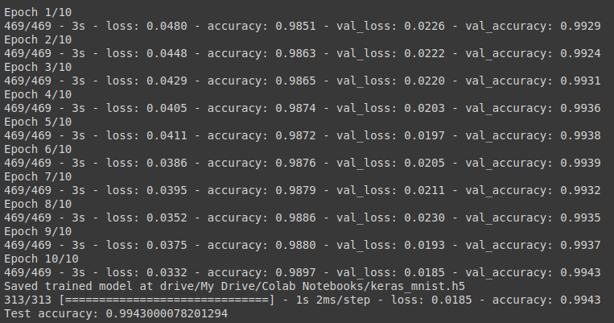

# Handwriting Digit Recognition with Convolutional Neural Network
Objective of this work is to identify and classify the Handwriting Digit Images from group 0 to 9 with ```Convolutional Neural Network``` 
And the model predict accuracy is **0.9943**. In addiction, ```google colaboratory GPU``` is recommended for the model training if you can't afford a better Graphic Card


## Structure
1. **Neural Network Structure**


2. **Model Structure Sample**


3. **Model Structure and Layes**


## Requirement
  - **Python 3.8.2 or above**
  - **GPU (recommended)**
  - **Tensorflow**
  - **Keras**
  - **Matplotlib**
  - **MNIST dataset**
  
## Build
```
python3 digit_recognition.py
```
## Output 
It show the **Handwriting Image** which provided by the ```MNIST``` and the model predict result 


## Prework and Setup
As above mentioned, if you are using ```google colaboratory GPU``` then you must install following module and packages for compile and build.

  - **python-mnist**
  - **keras**
  
```
!pip install python-mnist
!pip install keras
```

## Google GPU device list and information
For the GPU, you can use following code to check the how many **GPU devices** is listed and how many **RAM** you are using.
Adjust is available for it
```
import tensorflow as tf
from tensorflow.python.client import device_lib

tf.test.gpu_device_name()
device_lib.list_local_devices()
!cat /proc/meminfo
```


## Training Epoch with Model Loss and Accuracy Variation
From the output we can observe that model **Loss** is getting decrease and **Accuracy** become greater and approach **0.994**




## Reference
* https://nextjournal.com/gkoehler/digit-recognition-with-keras
* https://www.sitepoint.com/keras-digit-recognition-tutorial
